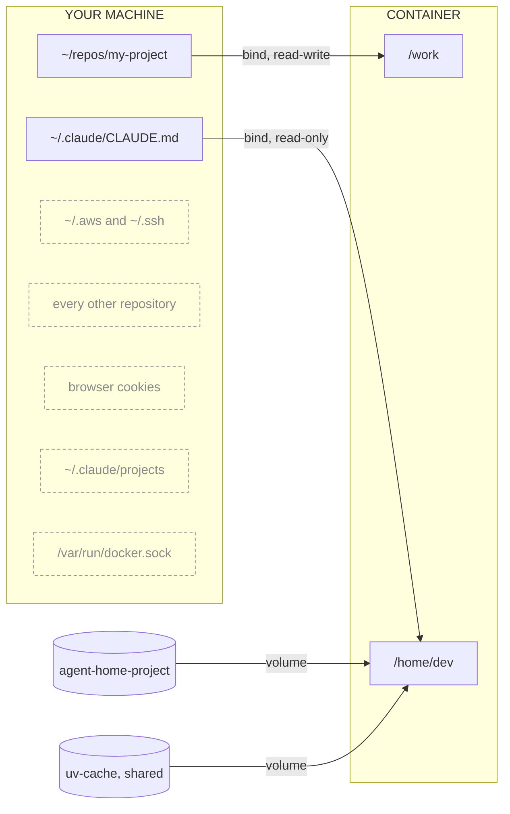
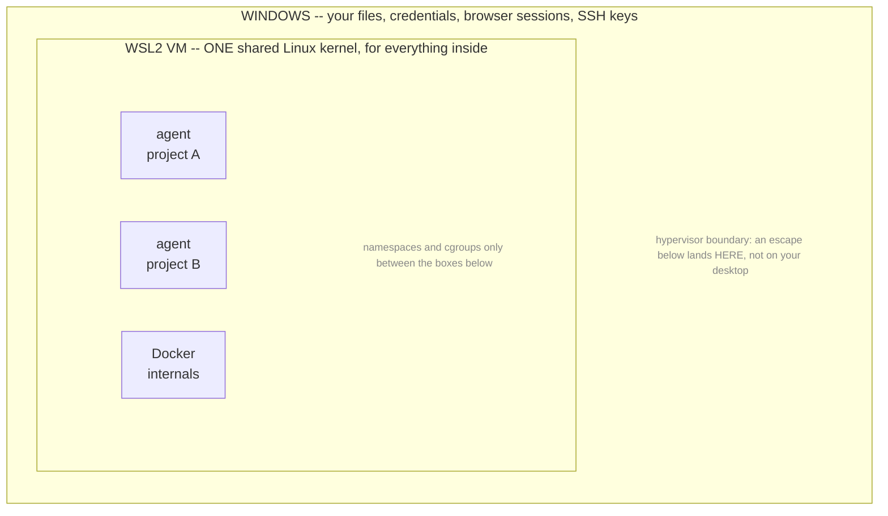

# vestibule

Run coding agents on Windows without giving them your whole machine.

**A coding agent you install normally runs as _you_** -- same user account, same
environment variables, same filesystem. It can read the `.env` in every project on your
machine, your `~/.aws` credentials, your SSH keys, your browser cookies. Not because it
is malicious, but because nothing separates its access from yours.

vestibule is a small launcher that runs them in a container instead. One project in reach,
nothing else. The agent logs in to Claude as itself rather than as you, so a bad session
cannot replay your identity anywhere.

```powershell
cd ~\repos\my-project
agent
```

> The project you *are* working on stays fully readable and writable -- the agent has to
> edit it. What moves out of reach is everything else.

Windows-first: Docker Desktop runs containers inside a WSL2 virtual machine, which is
where part of the isolation comes from. On native Linux you get materially less -- see
[property 1](#1-kernel-isolation).

## Status: early

Built for one person's machine and used daily there. Specifics beat a warning label:

- **Verified on** Windows 11, Docker Desktop 29.7.2, PowerShell 5.1.
- **Untested on** Windows 10, PowerShell 7, macOS, other Docker versions.
- **No third party has reviewed the security properties.** The reasoning is written out
  below rather than asserted, so you can check it rather than trust it.
- **The interface will change.** Flag names and volume naming are not stable.
- `verify.ps1` covers the failure modes found so far, and nothing else. That list is
  short because the project is young, not because it is finished.

## Read this before you rely on it

**What this is for:** running an agent harness against your own code without it reaching
the rest of your machine. It is not a sandbox for executing untrusted or AI-generated
code you have not reviewed. The limits below follow from that scope rather than being
shortfalls against it.

A security tool that overpromises is worse than none. What this does *not* do:

**It does not protect the project you mount.** That directory is a live bind mount and
the agent has to edit it. Commit before a session -- git is the undo, not the container.
`.env` files *inside* that project are readable by the agent; only other projects' are
out of reach.

**It does not stop exfiltration.** See [property 3](#3-governed-egress).

**It does not survive a kernel exploit.** See [property 1](#1-kernel-isolation).

**It does not verify what gets installed.** A malicious dependency runs happily inside
the sandbox. This limits its reach; it does not detect it.

**Credentials you hand it are readable by it.** See [property 4](#4-scoped-credentials).

**It records almost nothing.** Blocked network attempts are dropped silently, so you
cannot tell "the agent never tried" from "the agent tried forty times and was stopped".

**The mount list does not cover host network services.** Docker Desktop resolves
`host.docker.internal` from inside every container, so a session can reach anything your
host has listening. On a default Windows install that includes **SMB on port 445**,
verified reachable from a vestibule container. Reaching a service is not an escape -- SMB
demands authentication -- but with any valid Windows credential a session could mount
host shares and read or write outside `/work` entirely, bypassing the mount list. Two
things close it, neither of them the default: [property 3](#3-governed-egress), whose
default-deny policy drops the host gateway like any other unlisted destination, or
`agent -NoNetwork`. Both cost something -- the firewall needs `NET_ADMIN` back, and
`-NoNetwork` removes all egress.

**The container runtime is part of your trust base.** CVE-2025-9074 (CVSS 9.3, fixed in
Docker Desktop 4.44.3) let any container reach Docker's internal Engine API
unauthenticated, start a privileged container and mount the host filesystem. It needed
no Docker socket and worked with Enhanced Container Isolation on, so it defeated the
control this README ranks second. Keep Docker Desktop current; nothing here substitutes
for that.

What it *does* cover: your other repositories, `~/.aws`, `~/.ssh`, browser cookies, host
processes, the Docker socket, your host agent credentials and every past session's
transcripts -- plus caps on CPU, memory and process count so a runaway loop cannot take
the machine down.

---

## Prerequisites

| | Notes |
|---|---|
| **Windows 10 (2004+) or Windows 11** | Needed for the WSL2 backend |
| **Docker Desktop, WSL2 backend enabled** | Settings -> General -> "Use the WSL 2 based engine". Default on recent installs, but confirm -- see below. Developed against 29.7.2 |
| **PowerShell 5.1** | Ships with Windows. PowerShell 7 works too |
| **A Claude subscription** | Authenticated inside the container, not on the host |
| **~1 GB free disk** | The image is 250 MB; the rest is caches. Project dependencies are extra |
| **Git** | Only to clone this repository -- the container has its own |

**Not** required: a WSL2 Linux distribution of your own (Docker Desktop provides one),
Kubernetes, nested virtualisation, or administrator rights once Docker Desktop is
installed.

**Confirm the backend.** Docker Desktop can run on WSL2 or on Hyper-V, and this matters
beyond preference: the memory tuning and disk reclamation below are WSL2-only commands
that silently do nothing on the Hyper-V backend.

```powershell
wsl -l -v      # a "docker-desktop" distro listed = WSL2 backend in use
```

Both backends put containers in a VM, so the isolation argument in
[property 1](#1-kernel-isolation) holds either way. It is the maintenance advice that
assumes WSL2.

**On memory.** Sessions default to an 8 GB cap, and those caps limit each container
individually -- not the total. The WSL2 VM takes roughly half your RAM unless
`.wslconfig` says otherwise, and all containers share it. Running several sessions
alongside an application stack will exhaust it; use `agent -MemoryGb 4 -Cpus 2` for
parallel work, or raise the VM's allocation.

## Install

```powershell
git clone https://github.com/Shubh18s/vestibule.git
cd vestibule
.\install.ps1
```

Builds the image and adds one line to your PowerShell profile. Open a new shell, then
authenticate once inside a container:

```powershell
agent -Isolated
# inside:  claude   then /login
```

Check it works:

```powershell
.\verify.ps1
```

## Use

```powershell
cd ~\repos\any-project

agent                 # bash, this directory mounted, nothing else
agent claude          # straight into Claude Code
agent -Isolated       # mount nothing; git clone inside instead
agent -NoNetwork      # no egress at all
agent -Build          # rebuild the image first
```

Scope comes from the working directory. There is nothing to configure per project.

**Guard.** If the current directory is not a repository but contains some, `agent`
refuses -- running it from `~/repos` would otherwise mount every project you own. `cd`
into one repository, use `-Isolated`, or pass `-Force` for a deliberate multi-repo
session.

**Other harnesses.** Which agent CLIs the image contains is a build argument:

```powershell
agent -Build -BuildArg "HARNESSES=@anthropic-ai/claude-code opencode-ai"
agent opencode
```

Baking them in at build time is deliberate: the agent has no write access to
`/usr/local`, so it cannot update itself, and `docker history` shows exactly what went
in. Note the firewall's built-in allowlist names Anthropic endpoints only -- a harness
using another provider needs that host added to its project allowlist.

### VS Code instead of the terminal

```powershell
cd ~\repos\any-project
New-AgentDevcontainer
# Ctrl+Shift+P -> Dev Containers: Reopen in Container
```

Writes `.devcontainer/` from `template/`. Identical isolation -- `devcontainer.json` is a
declarative wrapper around the same docker flags -- and it reuses the same home volume, so
both launchers share one login and one session history.

### Several agents at once

tmux is in the image, so one container can host several agents on the same repository.
Give each its own git worktree:

```bash
agent                                        # one container for the project
tmux                                         # inside it
git worktree add .worktrees/feat-a -b feat-a # one per pane
```

What parallel agents need is not isolation from each other -- they are your code at the
same trust level -- but separate working trees, so two are not editing the same files or
running `git checkout` under one another. Worktrees share one object store, so branches
are immediately visible across panes.

Create worktrees **inside** `/work`. A worktree's `.git` is a file holding an absolute
path to the main repo, so one created on the host points somewhere that does not exist in
the container and every git command fails. Created inside, the path resolves.

A second terminal joins the same session with
`docker exec -it agent-myproject tmux attach`.

**The shipped tmux config is minimal**: default prefix, no keybindings, no colours. It
sets only what being in a container justifies. 100k scrollback, because agent runs are
long. Mouse on, because there is no host scrollback to fall back on. Truecolor, so diffs
do not drop to 8 colours. OSC 52 for the clipboard, since no `pbcopy` or X11 socket
exists inside. And zero escape-time, so agent TUIs stop swallowing ESC.

Your own config layers on top: tmux reads `/etc/tmux.conf` before `~/.tmux.conf`, so
writing yours into a project's home volume overrides everything shipped.

**Persistence caveat.** tmux is a child of the container's main process. Detaching tmux
is safe, but **closing the terminal that `agent` is attached to stops the container** and
takes every pane with it. For runs that must survive that, start the container detached
and exec into it:

```powershell
docker run -d --name agent-myproject ... vestibule:1 sleep infinity
docker exec -it agent-myproject tmux new-session -A -s main
```

### What `agent` actually runs

No magic -- the launcher only saves you typing:

```powershell
docker run -it --rm `
  --name agent-myproject `
  -v "$($PWD.Path):/work" -w /work `
  -v agent-home-myproject:/home/dev `
  -v uv-cache:/home/dev/.cache/uv `
  -v "$HOME\.claude\CLAUDE.md:/home/dev/.claude/CLAUDE.md:ro" `
  --network agent-net-myproject `
  --cap-drop=ALL `
  --security-opt=no-new-privileges `
  --memory=8g --memory-swap=8g `
  --cpus=4 `
  --pids-limit=512 `
  vestibule:1 bash
```

Those flags are not equally important. In descending order of what they buy:

1. **Mount narrowly.** `$PWD`, never `~/repos`. Add `:ro` for reference-only folders.
   Worth more than everything below it combined.
2. **Never mount `/var/run/docker.sock`.** Absent above, deliberately -- any process
   holding it can `docker run --privileged -v /:/host` and own the machine, voiding every
   other line here.
3. **`--cap-drop=ALL`** -- ordinary development needs no Linux capabilities, and most
   documented container escapes require at least one.
4. **`--security-opt=no-new-privileges`** -- blocks setuid escalation.
5. **Non-root user** -- baked into the image as `dev`.
6. **Resource caps** -- stop a runaway session taking the machine down.

---

## What crosses the boundary



Four connectors, and they are the entire security policy. The dashed items are not
*blocked* -- nothing checks them and refuses. No path is constructed in the first place,
so there is no rule to misconfigure and nothing for a persuasive prompt to talk its way
around. Adding a fifth line is a deliberate act; that is the whole review surface.

**Two kinds of connector.** A **bind** (rectangles) is a window onto your disk -- the same
bytes reachable by two paths, so the agent's edits land on your filesystem immediately.
A **volume** (cylinders) is Docker-managed storage inside the Linux VM: it outlives the
container, never appears as a browsable folder on your host, and vanishes on
`docker volume rm`.

## Four properties worth having

A sandbox for agent work is really four separate problems. Naming them separately keeps
the argument honest, because this implementation does not solve them equally well.

| | Property | Status | Mechanism |
|---|---|---|---|
| **1** | Kernel isolation | Partial by design | Namespaces and cgroups, every capability dropped, seccomp, plus a hypervisor boundary between containers and Windows -- **that last part exists only on Windows and macOS**. One kernel is shared across containers |
| **2** | Network policy enforcement | Implemented | A user-defined network per project. Sessions cannot reach one another, even by IP |
| **3** | Governed egress | **Absent by default** | Opt-in destination allowlist. Not weak in the default configuration -- *not present*. When enabled, filters by address only, not hostname or content |
| **4** | Scoped credentials | Implemented, with a floor | Subscription auth inside the container, per project. No host credentials mounted, no API key in the environment |

Be blunt about what that means in practice. **A plain `agent` session can reach any host
on the internet.** Property 2 stops it reaching your *other projects*; nothing stops it
reaching an arbitrary server. For the malicious-dependency threat this design targets,
egress is exactly where a compromise cashes out -- reading files is half of it, sending
them somewhere is the half that hurts. That half is opt-in, and off.

## 1. Kernel isolation

Windows cannot run Linux containers natively, so Docker Desktop runs them inside a WSL2
virtual machine. That is a real hypervisor boundary, and it works in your favour:



**In your favour:** an escape lands in the WSL2 VM, not in Windows. Getting from there to
your desktop needs a *hypervisor* exploit, a materially harder problem. macOS gets the
same benefit via Virtualization.framework.

**Against you:** that boundary is around *everything at once*, not around each container.
All agent containers, every WSL distribution and Docker's own internals share this one
kernel, so an attacker who escapes into the VM reaches every other container, every named
volume and every host folder any container has mounted. Installing more Linux
distributions does not add kernels.

So the VM protects your operating system. It does not isolate your projects from each
other -- properties 2 and 4 do that. A boundary around each *individual* container is
what gVisor and microVM runtimes are for, and that starts to matter when workloads
distrust each other. Here they do not: it is your code, on your laptop.

> ### If you are on native Linux, read this
>
> **There is no VM.** Docker runs containers directly on your host kernel, so this entire
> layer is absent -- an escape is immediately on your machine, with no second boundary to
> cross. That is not a flaw in Docker; it is what "native" means.
>
> Properties 2, 3 and 4 work identically for you. Property 1 does not, and this README's
> description of it does not apply to your setup.
>
> Use it on Linux if the mount-list and credential properties are what you are after.
> Do not use it on Linux believing you have the isolation described above.

## 2. Network policy enforcement

On Docker's **default bridge**, every container holds an address in one shared subnet and
can reach every other one by IP. There is no name resolution there, which is why this is
easy to miss -- but an address is all you need to scan a sibling and connect to it. One
project's session could reach another's, which would defeat the whole per-project model.

`agent` therefore creates a **user-defined network per project**. Outbound behaviour is
unchanged; peers simply stop being addressable. Attaching a service becomes a deliberate
act rather than an incidental one:

```powershell
docker network connect agent-net-myproject ollama
```

That is the mount-list principle applied to the network -- reach is granted, never
inherited.

**Cost:** networks outlive their containers, and Docker's default address pools allow
roughly thirty before allocation fails with an error that does not name the cause.
`docker network prune` is safe; `agent` recreates what it needs.

## 3. Governed egress

**The weakest of the four, and the one to be sceptical about.**

An optional in-container firewall resolves an allowlist of domains at startup and drops
everything else. It is **off by default**, because it needs `--cap-add=NET_ADMIN` -- and
dropping every capability is worth more than filtering destinations. To enable it for a
project:

```jsonc
"runArgs": ["--cap-add=NET_ADMIN", "--cap-add=NET_RAW", "..."],
"containerEnv": { "AGENT_ALLOWLIST": "/work/.devcontainer/allowed-domains.txt" },
"postStartCommand": "sudo /usr/local/bin/init-firewall.sh"
```

Three reasons it is a speed bump and not a wall:

1. It permits **addresses**, not hostnames. Package registries and source forges sit
   behind shared CDNs, so allowing them incidentally allows other tenants on the same
   edge addresses.
2. Those addresses rotate, so the rules break on their own schedule.
3. It filters destination, never content. A determined path out through an *allowed*
   host -- a gist, a package upload -- remains open.

Proper enforcement needs a forward proxy doing SNI or Host filtering, with the container
given no direct route. That is the intended direction for this property.

Two behaviours when it is on. **IPv6 is denied outright, not filtered** -- the allowlist
is IPv4-only, so rather than leave a second address family unpoliced the script sets an
`ip6tables` DROP policy, making the failure mode "IPv6 does not work" rather than "IPv6
is unfiltered". And **blocked connections hang rather than fail**, because rules `DROP`
rather than `REJECT`; in practice a blocked request looks like a slow one.

The strongest posture available today is `--network=none`, or an `--internal` network
shared only with a local model container: no egress at all, and no credential in the
container to exfiltrate.

## 4. Scoped credentials

The container authenticates to Claude **inside itself**, via the interactive login flow.
No API key in the image, the environment, or a file. Three properties follow: the
credential is scoped to the harness rather than general-purpose, it is revocable without
touching anything else, and your host credentials are never mounted -- so a compromise
here cannot replay your primary session elsewhere.

Home volumes are **per project**, so the token and transcripts of one project are not
readable from another. Transcripts are where pasted secrets and internal hostnames
accumulate, which is exactly why the host's own agent directory is never mounted.

**The floor:** nothing can protect a credential from code that legitimately needs it. If
a session must call an API, it holds that API's key and can send it anywhere it can
reach. No container, runtime or isolation tier changes that. For those, scope and caps
*are* the answer -- one key per tool, spend caps, short lifetimes, rotation, and treating
any key exposed to a strange session as burned.

---

## Layout

| Path | What |
|---|---|
| `image/Dockerfile` | The one image. Python, Node, uv, git, ripgrep, tmux, agent CLIs |
| `image/tmux.conf` | Installed to `/etc/tmux.conf`. Minimal on purpose; layer yours via `~/.tmux.conf` |
| `image/init-firewall.sh` | Optional egress allowlist. Off by default, see property 3 |
| `agent.ps1` | Defines `agent` and `New-AgentDevcontainer`; dot-sourced from your profile |
| `install.ps1` | One-time build and profile wiring |
| `verify.ps1` | Post-rebuild sanity checks |
| `template/` | Copied into a project as `.devcontainer/` |

## Volumes

| Mount | Type | Scope | Holds |
|---|---|---|---|
| `/work` | bind | per project | Your actual files, live on disk |
| `/home/dev` | `agent-home-<project>` | per project | Login, session history, tmux config |
| `/home/dev/.cache/uv` | `uv-cache` | shared | Downloaded wheels -- public artifacts only |

The cost of per-project home volumes is one login per repository. A single shared volume
is a one-line change if you prefer the convenience -- but it rebuilds inside the sandbox
the same credential pile the design avoids outside it.

## Notes

**Multi-repo sessions.** The mount list is the scope declaration. Add one bind per repo
the task needs, and mount reference-only repos `readonly`.

**Git identity does not come along.** No `.gitconfig` and no SSH keys inside, so commits
fail on missing identity until you set one, and pushing over SSH will not work. Set it
once per project; the home volume keeps it.

**The home volume is seeded once.** An empty volume is populated from the image the first
time it is mounted, never again. Adding files to the image's home directory will not
reach volumes that already exist.

**No GPU by default.** `--gpus all` needs the NVIDIA Container Toolkit, and the launcher
does not pass it. For a local model, run it in its own container and attach that to the
session's network rather than giving the agent the GPU.

**Nested virtualisation is not a security feature.** It is the capability to run a
hypervisor *inside* a VM, and comes up only because a microVM runtime would need to create
VMs while WSL2 is already one. Consumer Windows editions lack the hypervisor role, so
there is no `/dev/kvm` regardless of CPU -- which rules out microVM runtimes but not
gVisor, which needs no hardware virtualisation.

## Maintenance

```powershell
docker system df                  # what is reclaimable
docker system prune -a            # unused images and build cache
docker volume ls                  # one home volume per project adds up
docker network prune              # per-project networks
wsl --manage <distro> --set-sparse $true   # actually return space to Windows
```

The WSL2 virtual disk grows and never shrinks on its own. Pruning inside Linux does not
give the space back to the host without that last command.

## Scope

Deliberately small. A handful of files you can read in one sitting -- which for a security
tool is the point rather than a limitation. If you cannot audit it, you cannot rely on it.

It is aimed at one situation: a developer running a coding agent against their own code on
their own laptop. It is not a platform, it does not run untrusted third-party code, and it
does not try to be either.

## License

MIT
