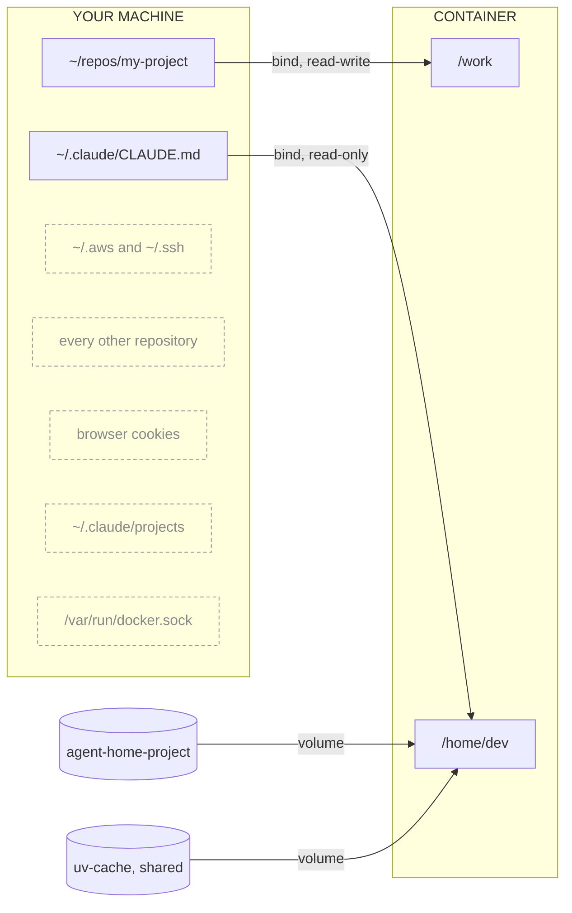

# vestibule

Run coding agents on Windows without giving them your whole machine.

**A coding agent you install normally runs as _you_** -- same user account, same
environment variables, same filesystem. It can read the `.env` in every project on your
machine, your `~/.aws` credentials, your SSH keys, your browser cookies. Not because it
is malicious, but because nothing separates its access from yours.

vestibule is a small launcher that runs them in a container instead. One project in reach,
nothing else. The agent logs in to Claude as itself rather than as you, so a bad session
cannot replay your identity anywhere.

Why this exists: [I Never Walked Away From My Agent. That Was the Problem.](https://medium.com/@singh18shubhdeep/i-never-walked-away-from-my-agent-that-was-the-problem-3ff2194a3960)

```powershell
cd ~\repos\my-project
agent
```

## What crosses the boundary



Four connectors, and they are the entire security policy. The dashed items have no
connector at all: nothing checks them and refuses, no path is constructed in the first
place, so there is no rule to misconfigure and nothing for a persuasive prompt to talk
its way around. Adding a fifth line is a deliberate act, and that is the whole review
surface.

**Two kinds of connector.** A **bind** (rectangles) is a window onto your disk -- the same
bytes reachable by two paths, so the agent's edits land on your filesystem immediately.
A **volume** (cylinders) is Docker-managed storage inside the Linux VM: it outlives the
container, never appears as a browsable folder on your host, and vanishes on
`docker volume rm`.

The project you *are* working on stays fully readable and writable -- the agent has to
edit it. What moves out of reach is everything else.

## What it does not do

It does not protect the project you mount, and it does not stop exfiltration -- egress
filtering is opt-in and off by default. A kernel exploit escapes into the WSL2 VM and
reaches other containers, though not Windows. Credentials you hand it are readable by it.

The full threat model, every known limit, and the reasoning behind each control:
**[docs/design.md](docs/design.md)**.

Windows-first: Docker Desktop runs containers inside a WSL2 virtual machine, which is where
part of the isolation comes from. **On native Linux you get materially less** -- see
[kernel isolation](docs/design.md#1-kernel-isolation).

Early, and used daily on one machine. Verified on Windows 11, Docker Desktop 29.7.2,
PowerShell 5.1. Untested on Windows 10, PowerShell 7, macOS. No third party has reviewed
the security properties, and flag names are not yet stable.

---

## Prerequisites

| | Notes |
|---|---|
| **Windows 10 (2004+) or Windows 11** | Needed for the WSL2 backend |
| **Docker Desktop, WSL2 backend enabled** | Settings -> General -> "Use the WSL 2 based engine". Default on recent installs, but confirm -- see below. Developed against 29.7.2 |
| **PowerShell 5.1** | Ships with Windows. PowerShell 7 works too |
| **A Claude subscription** | Authenticated inside the container, not on the host |
| **~1 GB free disk** | The image is 250 MB; the rest is caches. Project dependencies are extra |
| **Git** | Only to clone this repository -- the container has its own |

**Not** required: a WSL2 Linux distribution of your own (Docker Desktop provides one),
Kubernetes, nested virtualisation, or administrator rights once Docker Desktop is
installed.

**Confirm the backend.** Docker Desktop can run on WSL2 or on Hyper-V, and it matters
beyond preference: the memory tuning and disk reclamation below are WSL2-only commands
that do nothing on Hyper-V.

```powershell
wsl -l -v      # a "docker-desktop" distro listed = WSL2 backend in use
```

Both backends put containers in a VM, so the isolation argument holds either way. It is
the maintenance advice that assumes WSL2.

**On memory.** Sessions default to an 8 GB cap, applied per container rather than as a
total. The WSL2 VM takes roughly half your RAM unless `.wslconfig` says otherwise, and
all containers share it. Running several sessions alongside an application stack will
exhaust it; use `agent -MemoryGb 4 -Cpus 2` for parallel work, or raise the VM's
allocation.

## Install

```powershell
git clone https://github.com/Shubh18s/vestibule.git
cd vestibule
.\install.ps1
```

Builds the image, verifies it, and adds one line to your PowerShell profile. Open a new
shell, `cd` into a project, and authenticate inside the container:

```powershell
agent claude
# inside:  /login
```

Once per project, not once per machine. The credential lives on that project's home
volume, which is what keeps one project's session out of another's transcripts. An
`-Isolated` session mounts no home volume at all, so it holds no credential to
exfiltrate and logs in every time.

`verify.ps1` runs after every build, takes about nineteen seconds, and blocks the
session on failure. Run it by hand with `.\verify.ps1`, or pass `agent -SkipVerify` to
get past a known failure.

## Use

```powershell
cd ~\repos\any-project

agent                 # bash, this directory mounted, nothing else
agent claude          # straight into Claude Code
agent -Isolated       # scratch volume instead of this directory
agent -Firewall       # egress allowlist on
agent -NoNetwork      # no egress at all
agent -Build          # rebuild the image, then verify it
agent -SkipVerify     # skip that check
```

Scope comes from the working directory. There is nothing to configure per project.

### Every flag

| Flag | What it does | What it costs you |
|---|---|---|
| *(none)* | Current directory mounted read-write. Full internet | |
| `-Isolated` | A scratch volume at `/work` and nothing else. Nothing from your machine is mounted: no project, no login, no transcripts, no preferences. The scratch volume persists per project name | `git clone` inside to get started, and log in to Claude each session, since the container holds no credential of yours |
| `-NoNetwork` | `--network=none` | The agent cannot reach its own API, so no login and no Claude. See the combinations below |
| `-Firewall` | Egress allowlist, from the 5 built-in domains plus `.vestibule/allowed-domains.txt` in your project | Grants four capabilities during startup only. Blocked requests hang rather than fail |
| `-Env NAME=VALUE` | Passes variables that die with the container | The session can read them. Use short-lived, narrowly scoped values |
| `-Settings <path>` | Carries your agent configuration in read-only: `claude\CLAUDE.md`, `claude\commands\`, `claude\skills\`, `claude\hooks\`, `tmux.conf`. Defaults to `$env:VESTIBULE_SETTINGS` | Read-only, so a session cannot record a change to its own settings. It proposes one in the outbox instead |
| `-Force` | Overrides the repo-parent guard below. It does not override the scope refusal | |
| `-MemoryGb`, `-Cpus` | Default 8 and 4. Per container, not a total | |
| `-Build`, `-BuildArg` | Rebuild the image, then verify it | Minutes |
| `-SkipVerify` | Skip that check | |
| `-Image`, `-ContextDir` | Use a different tag or build context | |

**Pick one network posture.** No flag is all of the internet, `-Firewall` is the
allowlist, `-NoNetwork` is nothing.

### Bringing your own agent settings

Start from the skeleton rather than building the tree by hand:

```powershell
copy -Recurse "<vestibule>\template\settings" "$HOME\repos\my-agent-settings"
$env:VESTIBULE_SETTINGS = "$HOME\repos\my-agent-settings"
```

`-Settings <path>` mounts a directory of agent configuration into the session, read-only:

```
<settings>\claude\CLAUDE.md   ->  ~/.claude/CLAUDE.md
<settings>\claude\commands\   ->  ~/.claude/commands/
<settings>\claude\skills\     ->  ~/.claude/skills/
<settings>\claude\hooks\      ->  ~/.claude/hooks/
<settings>\tmux.conf          ->  ~/.tmux.conf
```

Every entry is optional; whatever exists is mounted. Set `$env:VESTIBULE_SETTINGS` once
rather than passing the flag each time.

**A subdirectory is one harness's configuration; the root is what they all share.**
`claude\` is Claude Code's. `tmux.conf` sits at the root because a multiplexer is not a
harness setting. Only `claude\` is implemented today -- another harness means adding its
mapping to `agent.ps1`, which is a launcher change you can review, rather than a manifest
inside the settings directory. That directory is mounted into the session, so a manifest
there would let an agent extend its own mount list.

**Read-only, because these are instructions and executable hooks that apply to every
future session.** A session able to edit them is a session able to rewrite the hook that
gates its own commits. To change them, run `agent` from inside the settings repository,
where it is the project at `/work` and writable like anything else.

That leaves one gap: a correction learned while working on some *other* project has
nowhere to go. `~/.vestibule/outbox` is mounted read-write for exactly that, so a session
can propose an amendment to its own settings without being able to make one take effect.

**Hooks are mounted, not wired.** A hook runs only when `~/.claude/settings.json` declares
it as a `PreToolUse` matcher, and that file lives on the per-project home volume rather
than in your settings directory. Until you add the block yourself, a mounted hook is
present, executable and never invoked.

### Combining them

- **`-Firewall -NoNetwork`** is refused with an error. They contradict.
- **`-NoNetwork -Isolated`** runs, and is the strongest posture available: nothing of
  yours mounted, no egress, no credential inside. Populate the scratch volume in a first
  session with the network on, then re-enter offline to run whatever you fetched. Claude
  itself cannot run offline, so that second session is for running code, not agents.
- **`-Firewall -Isolated`** runs, but the allowlist file lives in your project directory,
  which an isolated session does not mount. Only the 5 built-in domains apply, and
  `github.com` is not one of them, so `git clone` hangs. Use `-Isolated` on its own.
- **`-Isolated` already skips both guards**, so it never needs `-Force`.

**Two guards, and only one of them yields.**

**Scope.** Some directories are too broad to hand over at all, and `agent` refuses them
on the shape of the path rather than on what is inside: a drive root, your home directory
or anything above it, `Documents`, `Desktop`, `Downloads`, `OneDrive`, and the credential
stores `.ssh`, `.aws`, `.claude`, `.gnupg`, `.azure`, `.kube`, `.docker`, `.config`.
There is no `-Force` for these. `cd` into a single project, or use `-Isolated`.

The check reads the path because reading the contents cannot answer the question. This
guard originally asked only whether the directory held repositories as immediate
children, which `C:\Users\you` does not when they live in `~\repos`: `agent` in a home
directory mounted `.ssh`, `.aws` and `.claude` read-write at `/work` and reported a
normal session. A home directory holding no repositories is still a home directory, and
only the path knows that.

**Repo-parent.** If the current directory is not a repository but contains some, `agent`
refuses -- running it from `~/repos` would otherwise mount every project you own. `cd`
into one repository, use `-Isolated`, or pass `-Force` for a deliberate multi-repo
session.

**Passing a credential.** `-Env` takes `NAME=VALUE` pairs that live and die with the
container, unlike anything written into the home volume. Use short-lived, narrowly
scoped values; a credential passed this way is readable by the agent for the session:

```powershell
$c = aws configure export-credentials --profile bedrock-agent | ConvertFrom-Json
agent -Env "AWS_ACCESS_KEY_ID=$($c.AccessKeyId)",
           "AWS_SESSION_TOKEN=$($c.SessionToken)" opencode
```

The startup readout names the variables it was handed, never their values.

**Other harnesses.** Which agent CLIs the image contains is a build argument:

```powershell
agent -Build -BuildArg "HARNESSES=@anthropic-ai/claude-code opencode-ai"
agent opencode
```

Baking them in at build time is deliberate: the agent has no write access to
`/usr/local`, so it cannot update itself, and `docker history` shows exactly what went
in. Note the firewall's built-in allowlist names Anthropic endpoints only -- a harness
using another provider needs that host added to its project allowlist.

**VS Code instead of the terminal.**

```powershell
New-AgentDevcontainer
# Ctrl+Shift+P -> Dev Containers: Reopen in Container
```

Same isolation, same home volume, so both launchers share one login and one history. It
cannot apply the egress allowlist -- see [template/README.md](template/README.md) for why,
and for what to do instead.

**Several agents at once.** tmux is in the image, so one container can host several agents
on the same repository, each in its own git worktree. See
[docs/parallel-agents.md](docs/parallel-agents.md).

## What gets recorded

Both launchers append one line per session to `%LOCALAPPDATA%\vestibule\sessions.jsonl`,
outside any repository so no mount can reach it. `agent` warns if that ever stops being
true.

```powershell
Get-AgentSessions                    # last 20
Get-AgentSessions -Project myrepo    # one project
```

```
When        Project       Via          Cmd    Secs Net        Changed Exit
08-26 22:49 myrepo        agent        claude  361 allowlist        4    0
08-26 23:15 myrepo        devcontainer  ---    ---  default        ---  ---
```

Project, command, duration, network posture, the *names* of any `-Env` variables, exit
code, and files changed in the working tree. That last count comes from git on the host,
and `agent` prints it as a session ends. Devcontainer rows carry nulls for duration and
outcome, there being no host-side hook for a session ending: unknown, not clean.

It does not capture behaviour: not which commands ran, not what was attempted and
blocked.

---

## Layout

| Path | What |
|---|---|
| `image/Dockerfile` | The one image. Python, Node, uv, git, ripgrep, tmux, agent CLIs |
| `image/tmux.conf` | Installed to `/etc/tmux.conf`. Minimal on purpose; layer yours via `~/.tmux.conf` |
| `image/init-firewall.sh` | Optional egress allowlist. Off by default |
| `agent.ps1` | Defines `agent`, `Get-AgentSessions` and `New-AgentDevcontainer`; dot-sourced from your profile |
| `install.ps1` | One-time build and profile wiring |
| `verify.ps1` | Checks the built container against what is claimed. Runs after every build |
| `record-session.ps1` | Host-side session recorder, called by the devcontainer path |
| `template/` | Copied into a project as `.devcontainer/` |
| `template/settings/` | Skeleton for `-Settings`: layout, a stub `CLAUDE.md`, `.gitattributes`, and the `settings.json` hooks block |
| `docs/design.md` | Threat model, the four properties, known limits |
| `docs/mounts.md` | Every mount, its mode, and where a write actually ends up |

## Volumes

| Mount | Type | Scope | Holds |
|---|---|---|---|
| `/work` | bind | per project | Your actual files, live on disk |
| `/home/dev` | `agent-home-<project>` | per project | Login, session history, tmux config |
| `/home/dev/.cache/uv` | `uv-cache` | shared | Downloaded wheels -- public artifacts only |
| `~/.claude/CLAUDE.md`, `commands/`, `skills/`, `hooks/`, `~/.tmux.conf` | bind, **read-only** | `-Settings` only | Your agent configuration, carried in unchanged |
| `~/.vestibule/outbox` | bind | `-Settings` only | The one writable exception: changes a session proposes to its own settings, landing host-side in `%LOCALAPPDATA%\vestibule\outbox`. Under `~/.vestibule` rather than `~/.claude`, because the need comes from this launcher rather than from any harness |

A subdirectory under `-Settings` is one harness's configuration and the root is what all
of them share, so `claude\` is Claude Code and `tmux.conf` is at the root because a
multiplexer is not a harness setting. **Only `claude\` is implemented today.** Supporting
another harness means adding its mapping to `agent.ps1`, which is a launcher change you
can review, rather than a manifest inside the settings directory -- that directory is
mounted into the session, so a manifest there would let an agent extend its own mount
list.

Settings are read-only because they are instructions and executable hooks that apply to
every future session: a session able to edit them is a session able to rewrite the hook
that gates its own commits. To change them, run `agent` from inside the settings
repository, where it is the project at `/work` and writable like anything else.

Without `-Settings`, the host's own `~/.claude/CLAUDE.md` is mounted read-only as before,
and no outbox is created. The default mount list is unchanged.

Per-project home volumes cost one login per repository. A single shared volume is a
one-line change if you prefer the convenience, but it rebuilds inside the sandbox the
same credential pile the design avoids outside it.

## Notes

**Python environments land on the home volume, not your project.** The image sets
`UV_PROJECT_ENVIRONMENT=/home/dev/.venv`, so `uv sync` inside a session does not write a
`.venv` into your bind-mounted project. Without it a Linux virtualenv lands on your host,
where its binaries are the wrong platform and it can overwrite an environment you already
had there. Do not override it.


**Multi-repo sessions.** The mount list is the scope declaration. Add one bind per repo
the task needs, and mount reference-only repos `readonly`.

**Git identity does not come along.** No `.gitconfig` and no SSH keys inside, so commits
fail on missing identity until you set one, and pushing over SSH will not work. Set it
once per project; the home volume keeps it.

**The home volume is seeded once.** An empty volume is populated from the image the first
time it is mounted, never again. Adding files to the image's home directory will not
reach volumes that already exist.

**No GPU by default.** `--gpus all` needs the NVIDIA Container Toolkit and the launcher
does not pass it. For a local model, run it in its own container and attach that to the
session's network rather than giving the agent the GPU.

## Maintenance

```powershell
docker system df                  # what is reclaimable
docker system prune -a            # unused images and build cache
docker volume ls                  # one home volume per project adds up
docker network prune              # per-project networks
wsl --manage <distro> --set-sparse $true   # actually return space to Windows
```

The WSL2 virtual disk grows and never shrinks on its own. Pruning inside Linux does not
give the space back to the host without that last command.

## License

MIT
