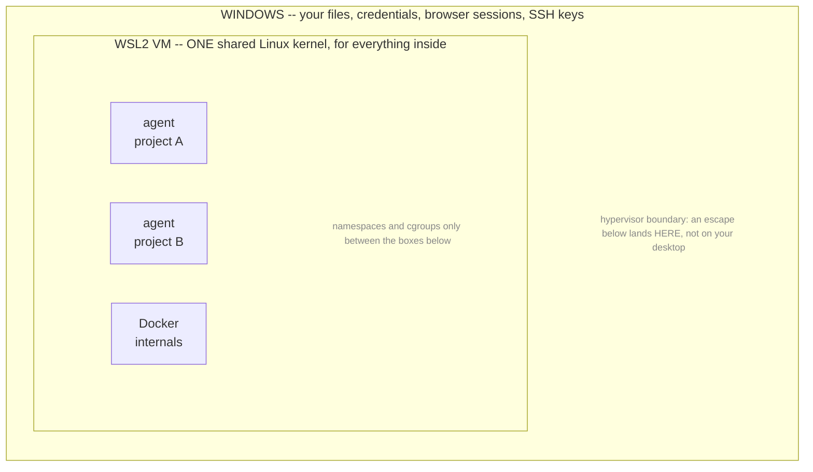

# Design

Why the container is configured the way it is, what that buys, and where it falls short.
The [README](../README.md) covers installing and using it.

## What it is for

Running an agent harness against **your own code** without it reaching the rest of your
machine. It is not a sandbox for executing untrusted or AI-generated code you have not
reviewed. The limits below follow from that scope rather than being shortfalls against
it.

## The controls, ranked

`agent` assembles a plain `docker run` and executes it. There is no framework and no
daemon; `agent.ps1` is a few hundred readable lines, and reading it is the authoritative
answer to what a session gets.

The flags it passes are not equally important. In descending order of what they buy:

1. **Mount narrowly.** `$PWD`, never `~/repos`. Add `:ro` for reference-only folders.
   Worth more than everything below it combined.
2. **Never mount `/var/run/docker.sock`.** Any process holding it can
   `docker run --privileged -v /:/host` and own the machine, voiding every other line
   here.
3. **`--cap-drop=ALL`.** Ordinary development needs no Linux capabilities, and most
   documented container escapes require at least one.
4. **`--security-opt=no-new-privileges`.** Blocks setuid escalation.
5. **Non-root user.** Baked into the image as `dev`.
6. **Resource caps.** `--memory`, `--cpus`, `--pids-limit`, so a runaway session cannot
   take the machine down.

That ranking is the design. Everything below is detail on how each is achieved and where
it leaks.

## Four properties worth having

A sandbox for agent work is four separate problems, and this implementation does not
solve them equally well.

| | Property | Status | Mechanism |
|---|---|---|---|
| **1** | Kernel isolation | Partial by design | Namespaces and cgroups, every capability dropped, seccomp, plus a hypervisor boundary between containers and Windows -- **that last part exists only on Windows and macOS**. One kernel is shared across containers |
| **2** | Network policy enforcement | Implemented | A user-defined network per project. Sessions cannot reach one another, even by IP |
| **3** | Governed egress | **Off by default** | Destination allowlist, enabled with `-Firewall`. Filters by IP address, not by hostname or content |
| **4** | Scoped credentials | Implemented, with a floor | Subscription auth inside the container, per project. No host credentials mounted, no API key in the environment |

In practice: **a plain `agent` session can reach any host on the internet.** Property 2
stops it reaching your *other projects*; nothing stops it reaching an arbitrary server.
Exfiltration needs two steps, reading the files and sending them somewhere. This design
addresses the first by default and the second only when `-Firewall` is passed.

## What it does not do

**It does not protect the project you mount.** A live bind mount the agent has to edit.
Commit before a session; git is the undo, not the container. `.env` files *inside* that
project are readable; only other projects' are out of reach.

**It does not stop exfiltration.** Destination filtering only, and off by default. See
[property 3](#3-governed-egress).

**A kernel exploit reaches other containers.** They share one kernel, so an escape
reaches every other container and anything mounted into them. What it does not reach is
Windows -- the WSL2 VM is still in the way. See [property 1](#1-kernel-isolation).

**It does not verify what gets installed.** A malicious dependency runs happily inside.
This limits its reach; it does not detect it.

**Credentials you hand it are readable by it.** See
[property 4](#4-scoped-credentials).

**It records what a session was, not what it did.** Configuration, duration, exit code
and working-tree changes, yes. Blocked attempts and which commands ran, no.

**The mount list does not cover host network services.** `host.docker.internal` resolves
inside every container, so a session can reach whatever your host is listening on --
including **SMB on port 445** on a default Windows install, verified. Not an escape by
itself, but with a valid Windows credential it is a route around the mount list.
`agent -Firewall` or `-NoNetwork` closes it; neither is the default.

**The container runtime is part of your trust base.** CVE-2025-9074 (CVSS 9.3, fixed in
Docker Desktop 4.44.3) let any container reach Docker's Engine API unauthenticated and
mount the host filesystem, with no Docker socket and with Enhanced Container Isolation
on. Keep Docker Desktop current; nothing here substitutes for that.

What it *does* cover: your other repositories, `~/.aws`, `~/.ssh`, browser cookies, host
processes, the Docker socket, your host agent credentials and every past session's
transcripts -- plus caps on CPU, memory and process count.

## 1. Kernel isolation

Windows cannot run Linux containers natively, so Docker Desktop runs them inside a WSL2
virtual machine. That is a real hypervisor boundary, and it works in your favour:



**In your favour:** an escape lands in the WSL2 VM, not in Windows. Getting from there to
your desktop needs a *hypervisor* exploit, a materially harder problem. macOS gets the
same benefit via Virtualization.framework.

**Against you:** that boundary is around *everything at once*, not around each container.
All agent containers, every WSL distribution and Docker's own internals share this one
kernel, so an attacker who escapes into the VM reaches every other container, every named
volume and every host folder any container has mounted. Installing more Linux
distributions does not add kernels.

So the VM protects your operating system. It does not isolate your projects from each
other -- properties 2 and 4 do that. A boundary around each *individual* container is
what gVisor and microVM runtimes are for, and that starts to matter when workloads
distrust each other. Here they do not: it is your code, on your laptop.

> ### If you are on native Linux, read this
>
> **There is no VM.** Docker runs containers directly on your host kernel, so this entire
> layer is absent -- an escape is immediately on your machine, with no second boundary to
> cross. That is not a flaw in Docker; it is what "native" means.
>
> Properties 2, 3 and 4 work identically for you. Property 1 does not, and this page's
> description of it does not apply to your setup.
>
> Use it on Linux if the mount-list and credential properties are what you are after.
> Do not use it on Linux believing you have the isolation described above.

**Nested virtualisation is not a security feature.** It is the capability to run a
hypervisor *inside* a VM, and comes up only because a microVM runtime would need to
create VMs while WSL2 is already one. Consumer Windows editions lack the hypervisor role,
so there is no `/dev/kvm` regardless of CPU -- which rules out microVM runtimes but not
gVisor, which needs no hardware virtualisation.

## 2. Network policy enforcement

On Docker's **default bridge**, every container holds an address in one shared subnet and
can reach every other one by IP. There is no name resolution there, which is why this is
easy to miss -- but an address is all you need to scan a sibling and connect to it. One
project's session could reach another's, which would defeat the whole per-project model.

`agent` therefore creates a **user-defined network per project**. Outbound behaviour is
unchanged; peers simply stop being addressable. Attaching a service becomes a deliberate
act rather than an incidental one:

```powershell
docker network connect agent-net-myproject ollama
```

This is the mount list applied to the network: a session reaches what it was explicitly
given and nothing else.

**Cost:** networks outlive their containers, and Docker's default address pools allow
roughly thirty before allocation fails with an error that does not name the cause.
`docker network prune` is safe; `agent` recreates what it needs.

## 3. Governed egress

**The weakest of the four.**

An in-container firewall resolves an allowlist of domains at startup and drops everything
else. It is **off by default**, and one flag away:

```powershell
agent -Firewall
```

**Why it is not the default.** Configuring the network requires permission over the
network -- `CAP_NET_ADMIN`, the capability `--cap-drop=ALL` had just removed. There is a
circularity there: to restrict what a container reaches, you must first grant it power
over what it reaches.

`-Firewall` settles that in *time* rather than in permissions. The container starts as
root with four capabilities, applies the rules, then `setpriv` hands the session to the
unprivileged `dev` user with `no-new-privileges` still set, so it cannot climb back and
`sudo` is refused outright. Root exists for the length of one script.

Running that script under `sudo` instead fails, by design: `no-new-privileges` blocks
setuid escalation. Making it work means removing that hardening for the whole session.
The devcontainer path has no way around this -- see
[template/README.md](../template/README.md).

Three reasons it slows an exfiltration attempt rather than stopping one:

1. It permits **addresses**, not hostnames. Package registries and source forges sit
   behind shared CDNs, so allowing them incidentally allows other tenants on the same
   edge addresses.
2. Those addresses rotate, so the rules break on their own schedule.
3. It filters destination, never content. A determined path out through an *allowed*
   host -- a gist, a package upload -- remains open.

Proper enforcement needs a forward proxy doing SNI or Host filtering, with the container
given no direct route. That is the intended direction for this property, and
[backlog item 8](../BACKLOG.md).

Two behaviours when it is on. **IPv6 is denied outright, not filtered** -- the allowlist
is IPv4-only, so rather than leave a second address family unpoliced the script sets an
`ip6tables` DROP policy, making the failure mode "IPv6 does not work" rather than "IPv6
is unfiltered". And **blocked connections hang rather than fail**, because rules `DROP`
rather than `REJECT`; in practice a blocked request looks like a slow one.

The built-in allowlist names Anthropic endpoints and the package registries only. A
harness using another provider, or a session that needs to reach a source forge, needs
those hosts in the project's `.vestibule/allowed-domains.txt`.

The strongest posture available today is `--network=none`, or an `--internal` network
shared only with a local model container: no egress at all, and no credential in the
container to exfiltrate.

## 4. Scoped credentials

The container authenticates to Claude **inside itself**, via the interactive login flow.
No API key in the image, the environment, or a file. Three properties follow: the
credential is scoped to the harness rather than general-purpose, it is revocable without
touching anything else, and your host credentials are never mounted -- so a compromise
here cannot replay your primary session elsewhere.

Home volumes are **per project**, so the token and transcripts of one project are not
readable from another. Transcripts are where pasted secrets and internal hostnames
accumulate, which is exactly why the host's own agent directory is never mounted.

**The floor:** nothing can protect a credential from code that legitimately needs it. If
a session must call an API, it holds that API's key and can send it anywhere it can
reach. No container, runtime or isolation tier changes that. For those, scope and caps
*are* the answer -- one key per tool, spend caps, short lifetimes, rotation, and treating
any key exposed to a strange session as burned.

## Verification

`verify.ps1` inspects the container that actually exists rather than trusting the script
that produced it. It runs after every build, from both `install.ps1` and `agent -Build`,
and a failure stops the session rather than warning.

The firewall once ran for an hour printing "egress allowlist active" while doing nothing,
because a byte-order mark ahead of the shebang made the kernel fall back to `/bin/sh`.
Nothing that reads the source catches that; a check that opens a socket does.

It covers the failure modes found so far and nothing else. That list is short because the
project is young, not because it is finished. The structural version of this argument is
[backlog item 1](../BACKLOG.md).

## Where this sits

Deliberately small, and aimed at one situation: a developer running a coding agent
against their own code on their own laptop. It is not a platform, it does not run
untrusted third-party code, and it does not try to be either.

It is a handful of files you can read in one sitting. If you cannot audit it, you cannot
rely on it.
